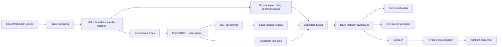

# my-sports-ai


SoccerNet broadcast videos에서 scoreboard, replay logo, broadcast text cue를 읽고, 설명 가능한 하이라이트 후보를 뽑아 실제 `highlight_top5.mp4`까지 자동 생성하는 연구/프로덕트형 파이프라인입니다.

이 프로젝트의 핵심은 “골 장면을 그냥 잘라내는 것”이 아니라, 왜 이 구간이 하이라이트인지 `score_change`, `replay_segment`, `text_cue`, `rank_score` 같은 근거와 함께 남기는 것입니다.

## Demo

공개 가능한 샘플 영상은 `docs/assets/demo/`에 올리는 구조로 준비되어 있습니다. SoccerNet 원본 영상은 라이선스/NDA 이슈가 있으므로, GitHub에는 권한 문제가 없는 짧은 데모 클립이나 블러 처리된 리뷰 영상을 올리는 것을 권장합니다.

<video src="docs/assets/demo/highlight_top5_sample.mp4" controls width="100%"></video>

Demo source:

```text
outputs/batch_5/matches/burnley_arsenal_2015_04_11/clips/rank_001__candidate_0007__h1__11m13s.mp4
```

현재 로컬에서 생성된 하이라이트 영상:

| Match | Highlight video | Size |
|---|---:|---:|
| Chelsea 1-1 Burnley | `outputs/batch_5/matches/chelsea_burnley_2015_02_21/highlights/highlight_top5.mp4` | 139.2 MB |
| Crystal Palace 1-2 Arsenal | `outputs/batch_5/matches/crystal_palace_arsenal_2015_02_21/highlights/highlight_top5.mp4` | 158.7 MB |
| Swansea 2-1 Manchester United | `outputs/batch_5/matches/swansea_manchester_united_2015_02_21/highlights/highlight_top5.mp4` | 115.4 MB |
| Southampton 0-2 Liverpool | `outputs/batch_5/matches/southampton_liverpool_2015_02_22/highlights/highlight_top5.mp4` | 110.7 MB |
| Burnley 0-1 Arsenal | `outputs/batch_5/matches/burnley_arsenal_2015_04_11/highlights/highlight_top5.mp4` | 118.8 MB |

리뷰용 contact sheet도 경기별로 생성됩니다.

```text
outputs/batch_5/matches/{match_id}/reviews/highlight_top5/contact_sheet.jpg
```

## Results

`configs/batch_5_matches.yml` 기준 EPL 2014-2015 5경기 배치 실행 결과입니다. 원본 결과는 `outputs/batch_5/batch_summary.csv`에 저장됩니다.

| Match | Status | Detections | OCR rows | Score events | Text events | Candidates | Clips | Top-5 Recall@30s | Video |
|---|---|---:|---:|---:|---:|---:|---:|---:|---|
| Chelsea 1-1 Burnley | completed | 5,393 | 5,277 | 1 | 177 | 67 | 8 | 1.000 | yes |
| Crystal Palace 1-2 Arsenal | completed | 5,774 | 5,548 | 3 | 111 | 70 | 10 | 1.000 | yes |
| Swansea 2-1 Manchester United | completed | 5,904 | 5,417 | 3 | 248 | 58 | 10 | 1.000 | yes |
| Southampton 0-2 Liverpool | completed | 5,507 | 5,374 | 2 | 199 | 69 | 9 | 1.000 | yes |
| Burnley 0-1 Arsenal | completed | 5,720 | 5,336 | 1 | 444 | 55 | 10 | 1.000 | yes |

Batch totals:

| Metric | Value |
|---|---:|
| Matches | 5 |
| Graphic detections | 28,298 |
| Scoreboard OCR rows | 26,952 |
| Score change events | 10 |
| Broadcast text events | 1,179 |
| Ranked highlight candidates | 319 |
| Extracted clips | 47 |
| Generated highlight videos | 5 |

## Architecture



## Pipeline

The default batch runner executes these stages:

```text
frames -> detect -> replay -> crops -> ocr -> reparse -> smooth
-> overlay_ocr -> overlay_text -> text -> fuse -> rank -> eval
-> review -> clip_plan -> clips -> compose
```

Key implementation modules:

| Area | Files |
|---|---|
| Batch orchestration | `src/pipeline/run_batch.py` |
| Frame sampling | `src/phase1a.py`, `src/video/frame_sampler.py` |
| Graphic detection | `src/vision/detect_graphics.py`, `src/vision/train_detector.py` |
| Replay events | `src/vision/build_replay_events.py` |
| Scoreboard OCR | `src/ocr/run_scoreboard_ocr.py`, `src/ocr/reparse_scoreboard_ocr.py`, `src/ocr/smooth_scoreboard_ocr.py` |
| Text cue extraction | `src/ocr/extract_text_cues.py` |
| Candidate fusion/ranking | `src/events/fuse_highlight_candidates.py`, `src/events/rank_highlight_candidates.py` |
| Evaluation/review | `src/evaluation/evaluate_topk_candidates.py`, `src/events/render_ranked_candidates.py` |
| Video generation | `src/video/build_clip_plan.py`, `src/video/extract_highlight_clips.py`, `src/video/compose_highlight_video.py` |

## Quick Start

### 1. Environment

Create `.env` with your SoccerNet password:

```text
SOCCERNET_PW=
```

### 2. GUI downloader

```bash
docker compose up --build
```

Open:

```text
http://localhost:8501
```

### 3. GPU batch pipeline

```powershell
docker compose -f compose.gpu.yml run --rm vision-gpu python3 -m src.pipeline.run_batch `
  --config configs/batch_5_matches.yml `
  --skip-existing `
  --continue-on-error
```

Run only video-generation stages after candidates already exist:

```powershell
docker compose -f compose.gpu.yml run --rm vision-gpu python3 -m src.pipeline.run_batch `
  --config configs/batch_5_matches.yml `
  --stages clip_plan,clips,compose `
  --skip-existing `
  --continue-on-error
```

## Output Layout

```text
outputs/batch_5/
  batch_summary.csv
  matches/
    {match_id}/
      detections/graphics.csv
      events/
        replay_events.csv
        score_change_events.csv
        text_cues.csv
        highlight_candidates.csv
        highlight_candidates_ranked.csv
      ocr/
        scoreboard_full.csv
        scoreboard_full_reparsed.csv
        scoreboard_smoothed.csv
      clips/
        clip_plan.csv
        rank_001__candidate_*.mp4
      highlights/
        highlight_top5.mp4
      reports/
        highlight_topk_eval.csv
        clip_extraction_report.csv
      reviews/
        highlight_top5/contact_sheet.jpg
```

## Research Question

```text
Can broadcast graphics and OCR events from soccer videos produce explainable highlight videos with enough temporal precision to recover goal moments?
```

Working hypothesis:

```text
scoreboard score changes + replay logos + broadcast text cues
-> explainable event graph
-> ranked highlight candidates
-> clip plan
-> automatic highlight video
```

## Documentation

| Document | Purpose |
|---|---|
| [PROJECT_MASTER_PLAN.md](PROJECT_MASTER_PLAN.md) | Project roadmap and development priorities |
| [BATCH_5_MATCH_GUIDE.md](BATCH_5_MATCH_GUIDE.md) | 5-match batch execution and validation guide |
| [HIGHLIGHT_VIDEO_AUTOMATION_DESIGN.md](HIGHLIGHT_VIDEO_AUTOMATION_DESIGN.md) | Clip planning, extraction, and composition design |
| [OCR_SCOREBOARD_TEST_GUIDE.md](OCR_SCOREBOARD_TEST_GUIDE.md) | Scoreboard OCR and score-change evaluation workflow |
| [YOLO_DATASET_TEST_GUIDE.md](YOLO_DATASET_TEST_GUIDE.md) | YOLO dataset preparation and training workflow |
| [RUN_GUIDE.md](RUN_GUIDE.md) | GUI and downloader usage |
| [SETUP_GUIDE.md](SETUP_GUIDE.md) | Initial setup |
| [TROUBLESHOOTING.md](TROUBLESHOOTING.md) | Known issues and fixes |
| [docs/RESEARCH_ARCHITECTURE.md](docs/RESEARCH_ARCHITECTURE.md) | Research architecture |
| [docs/PHASE_1_VISION_OCR_PIPELINE.md](docs/PHASE_1_VISION_OCR_PIPELINE.md) | Phase 1 Vision/OCR pipeline |
| [docs/TECHNICAL_SPEC.md](docs/TECHNICAL_SPEC.md) | GPU, model, and library specification |

## Dataset And License Notes

SoccerNet broadcast videos and labels are not redistributed in this repository. Downloaded data stays under `data/spotting/`, model weights stay under `models/`, and generated outputs stay under `outputs/`.

The repository code can be shared independently, but any public demo video must respect the original content license and SoccerNet access terms.
