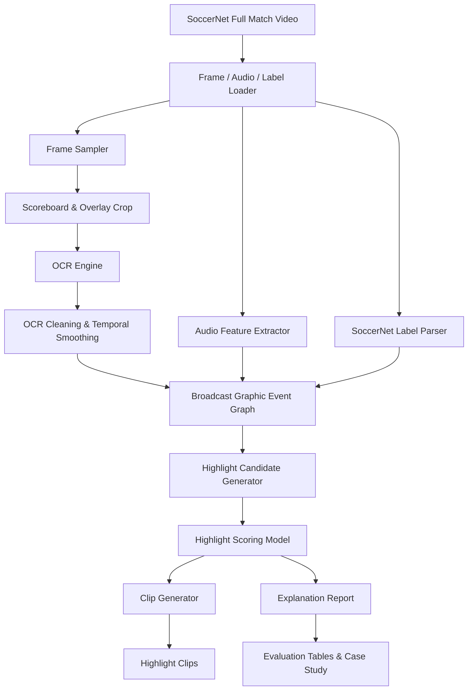
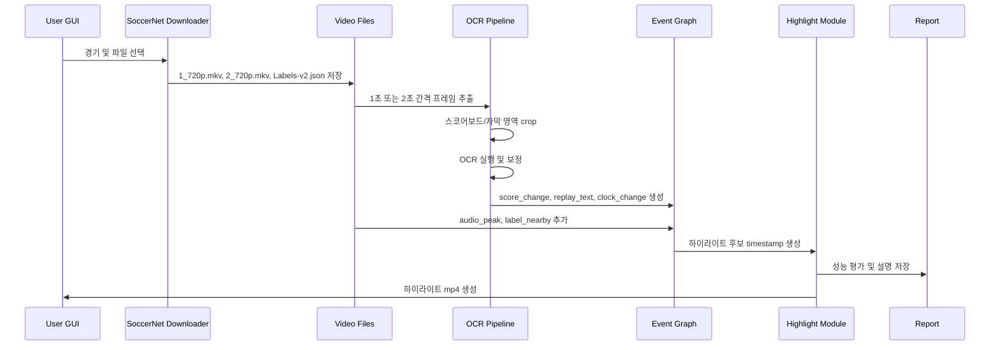
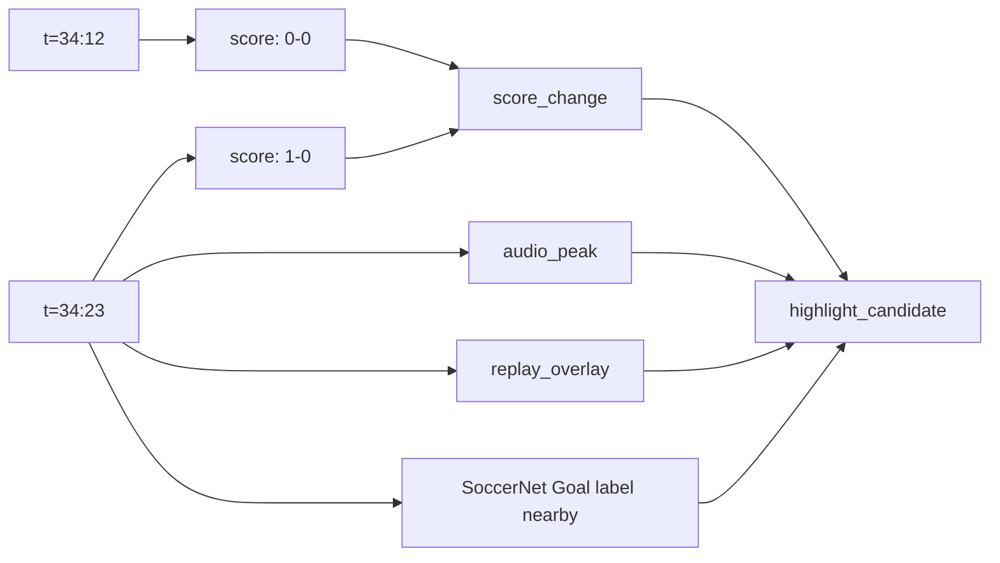
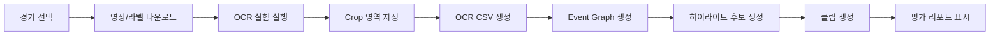

# 축구 중계 영상의 그래픽 OCR 이벤트 그래프를 이용한 설명 가능한 하이라이트 생성

## 1. 연구 개요

본 연구는 축구 중계 풀 영상에서 하이라이트 후보를 자동으로 탐지하고, 각 후보가 선택된 이유를 설명하는 프레임워크를 제안한다.

핵심 아이디어는 중계 화면에 이미 포함된 스코어보드, 경기 시간, 점수, 리플레이 그래픽, VAR 문구, 선수명/이벤트 자막을 OCR로 추출한 뒤, 이를 시간축 이벤트 그래프로 구조화하는 것이다.

제안하는 시스템은 단순히 비디오 프레임을 분석하는 모델이 아니라, 중계 제작자가 화면에 삽입한 그래픽 정보를 활용하여 하이라이트의 시간적 단서를 찾는다.

## 2. 연구 질문

### RQ1. 중계 그래픽 OCR 정보는 축구 하이라이트 탐지에 유효한 시간적 단서가 될 수 있는가?

스코어보드의 점수 변화, 경기 시간 변화, 리플레이/VAR/카드/교체 자막은 골과 주요 이벤트 근처에서 자주 발생한다.

### RQ2. OCR 결과를 시간축으로 smoothing하면 raw OCR보다 안정적인 이벤트 탐지가 가능한가?

OCR은 프레임 단위에서는 오류가 많다. 하지만 여러 초 동안 반복 관측하면 점수, 팀명, 경기 시간 같은 구조적 정보는 안정화할 수 있다.

### RQ3. OCR 이벤트 그래프를 비디오/오디오/라벨 정보와 결합하면 설명 가능한 하이라이트 생성이 가능한가?

하이라이트 후보마다 `score_change`, `replay_overlay`, `audio_peak`, `label_nearby` 같은 근거를 함께 저장하면 모델의 판단을 사람이 이해할 수 있다.

## 3. 목표 논문 포지셔닝

### 한국어 제목 후보

축구 중계 영상의 그래픽 OCR 이벤트 그래프를 이용한 설명 가능한 하이라이트 생성

### 영문 제목 후보

Explainable Soccer Highlight Generation via Broadcast Graphic OCR Event Graphs

### 핵심 기여

1. Broadcast Graphic Event Graph 제안
2. OCR 기반 score/replay/overlay 이벤트의 시간축 구조화
3. OCR 이벤트 그래프 기반 설명 가능한 하이라이트 후보 생성
4. SoccerNet 기반 mini benchmark와 ablation 실험

## 4. 전체 시스템 아키텍처



## 5. 데이터 흐름



## 6. 모듈별 상세 설계

### 6.1 Data Layer

목표는 SoccerNet 경기 데이터를 일관된 내부 경로와 메타데이터로 관리하는 것이다.

입력:

```text
data/spotting/{league}/{season}/{match}/
  ├── 1_720p.mkv
  ├── 2_720p.mkv
  └── Labels-v2.json
```

출력:

```text
match_id
league
season
split
half
video_path
label_path
timeline_offset
```

### 6.2 Frame Sampler

풀 영상을 매 프레임 분석하지 않고, OCR 및 후보 탐지를 위한 샘플 프레임을 추출한다.

기본 설정:

```text
sampling_fps = 1
resolution = source 또는 720p
output = outputs/frames/{match_id}/{half}/{timestamp}.jpg
```

확장 설정:

```text
OCR 탐지용: 1fps
리플레이/장면 전환 탐지용: 2fps
정밀 분석용: 후보 구간에서만 5fps 이상
```

### 6.3 Scoreboard & Overlay OCR

처음에는 수동 crop으로 시작하고, 이후 자동 scoreboard detection으로 확장한다.

초기 접근:

```text
1. 경기별 대표 프레임 표시
2. 사용자가 scoreboard 영역 지정
3. 해당 crop 좌표를 crop_config.json에 저장
4. 전체 영상에 동일 crop 적용
```

OCR 대상:

```text
경기 시간
홈/원정 팀명
현재 점수
추가시간
Replay / VAR / Goal / Card / Substitution 자막
선수명 그래픽
```

### 6.4 OCR Cleaning & Temporal Smoothing

OCR 오류를 줄이기 위해 프레임 단위 결과를 시간축으로 보정한다.

보정 예시:

```text
I-0 -> 1-0
O-0 -> 0-0
l -> 1
S8:12 -> 58:12
```

Smoothing 규칙:

```text
최근 5초 window에서 점수 다수결
경기 시간은 단조 증가하도록 보정
한 프레임에서만 나타나는 score change는 제거
불가능한 점수 감소는 제거
```

### 6.5 Broadcast Graphic Event Graph

OCR 결과와 비디오/오디오/라벨 정보를 시간축 그래프로 통합한다.



노드 타입:

```text
score_state
score_change
clock_state
clock_jump
replay_overlay
var_overlay
player_name_overlay
label_nearby
audio_peak
camera_cut_density
highlight_candidate
```

엣지 타입:

```text
before / after
same_window
supports
contradicts
near_label
causes_candidate
```

## 7. 하이라이트 후보 생성

후보 timestamp는 여러 신호를 통해 생성한다.

```text
score_change 발생 시점
replay_overlay 발생 시점
Goal/Card/Substitution label 근처
audio_peak 발생 시점
camera cut density가 급증한 시점
OCR 자막에 이벤트 단어가 등장한 시점
```

후보 구간 생성 규칙:

```text
Goal: timestamp - 20s ~ timestamp + 25s
Card: timestamp - 10s ~ timestamp + 15s
Substitution: timestamp - 10s ~ timestamp + 20s
Replay: replay 시작 전후 실제 event timestamp 중심
```

가까운 후보 병합:

```text
두 후보 구간이 10초 이내로 겹치거나 가까우면 하나의 클립으로 병합
최대 클립 길이는 60초로 제한
```

## 8. 하이라이트 점수화 모델

### 8.1 Rule-Based Baseline

```text
score_change: +5
replay_overlay: +3
audio_peak: +2
label_nearby: +5
camera_cut_density_high: +1
event_text_detected: +2
```

### 8.2 Lightweight ML Model

입력 feature:

```text
has_score_change
score_change_confidence
has_replay_overlay
has_event_text
audio_peak_strength
camera_cut_density
distance_to_label
ocr_confidence
candidate_duration
```

모델 후보:

```text
Logistic Regression
XGBoost / LightGBM
MLP
```

### 8.3 Temporal Transformer Extension

RTX 3090을 활용해 시간축 feature sequence를 입력으로 받는 작은 Transformer를 학습할 수 있다.

```text
Input: [video_feature, audio_feature, ocr_event_feature] per second
Output: highlight probability per timestamp
```

짧은 기간에서는 optional 확장으로 둔다.

## 9. 실험 설계

### 9.1 Phase 1: Goal 중심 실험

목표:

```text
스코어보드 OCR 점수 변화만으로 Goal 후보를 얼마나 잘 찾는지 측정
```

데이터:

```text
10-20 경기
1_720p.mkv 또는 224p
Labels-v2.json
```

평가:

```text
Recall@±5s
Recall@±10s
Recall@±30s
Precision
F1
```

### 9.2 Phase 2: OCR Event Graph 실험

목표:

```text
score_change 외에 replay_overlay, event_text, audio_peak를 결합했을 때 성능 향상 확인
```

평가:

```text
Highlight Event Coverage
Average Highlight Duration
Hit Rate per Generated Clip
```

### 9.3 Phase 3: 설명 가능성 평가

목표:

```text
생성된 하이라이트마다 선택 이유를 사람이 이해할 수 있는 형태로 제공
```

예시:

```json
{
  "timestamp": "34:23",
  "event": "Goal candidate",
  "score": 12.5,
  "reasons": [
    "score changed from 0-0 to 1-0",
    "audio peak detected",
    "replay overlay appeared within 20 seconds",
    "near SoccerNet Goal label"
  ]
}
```

## 10. Baseline 및 Ablation

### Baseline

```text
B1. Uniform sampling
B2. SoccerNet label-only
B3. Raw OCR score-change
B4. Smoothed OCR score-change
B5. Video/audio feature only
Ours. Broadcast Graphic Event Graph
```

### Ablation

```text
Ours without OCR smoothing
Ours without replay overlay
Ours without audio peak
Ours without label-nearby feature
Ours without event graph, feature concatenation only
```

## 11. 예상 결과 표

| Method | Recall@5s | Recall@10s | Recall@30s | Precision | F1 |
|---|---:|---:|---:|---:|---:|
| Uniform Sampling | - | - | - | - | - |
| Raw OCR | - | - | - | - | - |
| Smoothed OCR | - | - | - | - | - |
| Video/Audio Only | - | - | - | - | - |
| Proposed Event Graph | - | - | - | - | - |

## 12. 산출물 구조

```text
outputs/
  frames/
    {match_id}/
  crops/
    {match_id}/
  ocr_csv/
    {match_id}.csv
  event_graphs/
    {match_id}.json
  candidates/
    {match_id}.json
  clips/
    {match_id}/
  reports/
    {match_id}_evaluation.md
```

## 13. 코드 구조 제안

```text
src/
  data/
    soccernet_paths.py
    labels.py
  video/
    frame_sampler.py
    clipper.py
    audio_features.py
    scene_features.py
  ocr/
    crop_config.py
    run_ocr.py
    clean_ocr.py
    smoothing.py
  graph/
    event_graph.py
    graph_schema.py
  highlight/
    candidate_generator.py
    scorer.py
    explainer.py
  evaluation/
    metrics.py
    report.py
  app/
    gui.py
```

## 14. GUI 확장 계획

현재 GUI는 SoccerNet 경기 선택 및 다운로드에 초점을 둔다. 다음 단계에서는 연구 실험을 실행하는 기능을 추가한다.



GUI 버튼:

```text
선택 경기 OCR 실험 실행
스코어보드 Crop 설정
OCR 결과 CSV 보기
점수 변화 후보 보기
하이라이트 클립 생성
평가 리포트 열기
```

## 15. 연구 로드맵

### Milestone 1. OCR Pipeline

```text
5경기 기준
프레임 추출
crop 설정
OCR CSV 저장
```

### Milestone 2. Score Change Detection

```text
OCR cleaning
temporal smoothing
score_change timestamp 추출
Goal label과 비교
```

### Milestone 3. Event Graph

```text
score_change
replay_overlay
audio_peak
label_nearby
highlight_candidate 노드 생성
```

### Milestone 4. Highlight Generation

```text
candidate scoring
clip cutting
explanation json
evaluation report
```

### Milestone 5. Paper Package

```text
architecture figure
event graph figure
result tables
case studies
failure analysis
한국어 논문 초안
```

## 16. 성공적인 학회 논문으로 만들기 위한 기준

최소 성공 조건:

```text
10경기 이상 실험
Goal detection 성능 표
OCR smoothing ablation
하이라이트 클립 데모
설명 report 예시
```

강한 논문 조건:

```text
30-50경기 실험
Goal + replay + card/substitution 일부 포함
Broadcast Graphic Event Graph 시각화
baseline 4개 이상 비교
실패 사례 분석
mini benchmark 정리
```

## 17. 핵심 메시지

이 연구의 가장 중요한 주장은 다음과 같다.

> 축구 중계 화면의 그래픽 정보는 단순한 시각적 장식이 아니라, 하이라이트 생성에 활용 가능한 구조적 시간 단서이다.

이 주장을 증명하기 위해 OCR 결과를 시간축 이벤트 그래프로 변환하고, 이를 기반으로 하이라이트 후보를 생성하며, 각 후보의 선택 이유를 설명한다.
