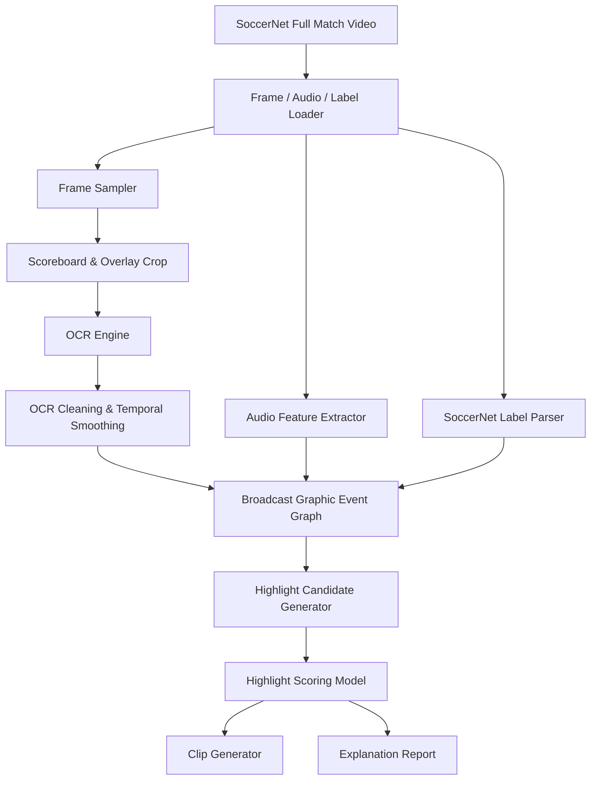
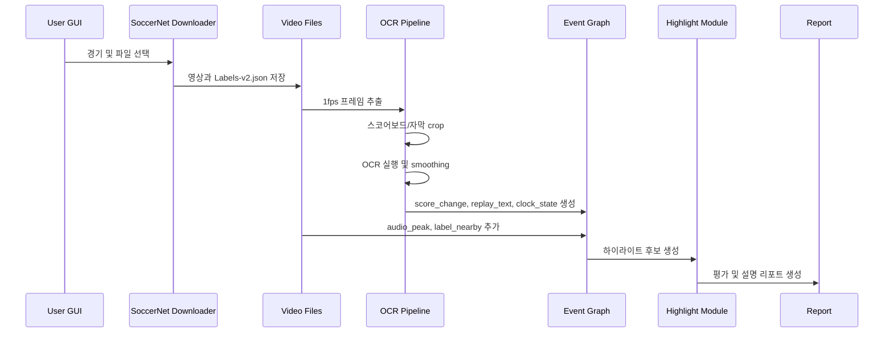

# 연구 아키텍처

## 1. 연구 개요

본 연구는 SoccerNet 축구 중계 풀 영상에서 하이라이트 후보를 자동 탐지하고, 각 후보가 선택된 이유를 설명하는 프레임워크를 제안합니다.

핵심 아이디어는 중계 화면에 포함된 스코어보드, 경기 시간, 점수, 리플레이 그래픽, VAR 문구, 선수명/이벤트 자막을 OCR로 추출한 뒤, 이를 시간축 이벤트 그래프로 구조화하는 것입니다.

## 2. 연구 질문

### RQ1. 중계 그래픽 OCR 정보는 하이라이트 탐지에 유효한 시간적 단서인가?

스코어보드의 점수 변화, 경기 시간 변화, 리플레이/VAR/카드/교체 자막은 주요 이벤트 근처에서 자주 발생합니다.

### RQ2. OCR 결과를 시간축으로 smoothing하면 raw OCR보다 안정적인 이벤트 탐지가 가능한가?

OCR은 프레임 단위에서는 오류가 많지만, 여러 초 동안 반복 관측하면 점수와 경기 시간 같은 구조적 정보는 안정화할 수 있습니다.

### RQ3. OCR 이벤트 그래프를 라벨, 오디오, 장면 정보와 결합하면 설명 가능한 하이라이트 생성이 가능한가?

하이라이트 후보마다 `score_change`, `replay_overlay`, `audio_peak`, `label_nearby` 같은 근거를 저장하면 모델 판단을 사람이 이해할 수 있습니다.

## 3. 목표 논문 포지셔닝

한국어 제목 후보:

```text
축구 중계 영상의 그래픽 OCR 이벤트 그래프를 이용한 설명 가능한 하이라이트 생성
```

영문 제목 후보:

```text
Explainable Soccer Highlight Generation via Broadcast Graphic OCR Event Graphs
```

핵심 기여:

1. Broadcast Graphic Event Graph 제안
2. OCR 기반 score/replay/overlay 이벤트의 시간축 구조화
3. OCR 이벤트 그래프 기반 설명 가능한 하이라이트 후보 생성
4. SoccerNet 기반 mini benchmark와 ablation 실험

## 4. 전체 시스템 아키텍처



## 5. 데이터 흐름



## 6. 모듈 설계

### 6.1 Data Layer

입력:

```text
data/spotting/{league}/{season}/{match}/
  ├── 1_720p.mkv
  ├── 2_720p.mkv
  └── Labels-v2.json
```

출력 메타데이터:

```text
match_id
league
season
split
half
video_path
label_path
timeline_offset
```

### 6.2 Vision & OCR Layer

상세 실행 명세는 [PHASE_1_VISION_OCR_PIPELINE.md](PHASE_1_VISION_OCR_PIPELINE.md)를 기준으로 합니다.

핵심 단계:

```text
Frame sampling
Manual crop config
OCR execution
OCR cleaning
Temporal smoothing
Score change detection
```

### 6.3 Broadcast Graphic Event Graph

OCR 결과와 라벨, 오디오, 장면 정보를 시간축 그래프로 통합합니다.

노드 타입:

```text
score_state
score_change
clock_state
clock_jump
replay_overlay
var_overlay
player_name_overlay
label_nearby
audio_peak
camera_cut_density
highlight_candidate
```

엣지 타입:

```text
before
after
same_window
supports
contradicts
near_label
causes_candidate
```

## 7. 하이라이트 후보 생성

후보 timestamp는 여러 신호를 통해 생성합니다.

```text
score_change 발생 시점
replay_overlay 발생 시점
Goal/Card/Substitution label 근처
audio_peak 발생 시점
camera cut density 급증 시점
OCR 자막에 이벤트 단어가 등장한 시점
```

후보 구간 규칙:

```text
Goal: timestamp - 20s ~ timestamp + 25s
Card: timestamp - 10s ~ timestamp + 15s
Substitution: timestamp - 10s ~ timestamp + 20s
Replay: replay 시작 전후 실제 event timestamp 중심
```

## 8. 실험 설계

### Phase 1. Goal 중심 OCR 실험

목표:

```text
스코어보드 OCR 점수 변화만으로 Goal 후보를 얼마나 잘 찾는지 측정
```

평가:

```text
Recall@5s
Recall@10s
Recall@30s
False positive per match
```

### Phase 2. OCR Event Graph 실험

목표:

```text
score_change 외에 replay_overlay, event_text, audio_peak를 결합했을 때 성능 향상 확인
```

### Phase 3. 설명 가능성 평가

예시 출력:

```json
{
  "timestamp": "34:23",
  "event": "Goal candidate",
  "score": 12.5,
  "reasons": [
    "score changed from 0-0 to 1-0",
    "audio peak detected",
    "replay overlay appeared within 20 seconds",
    "near SoccerNet Goal label"
  ]
}
```

## 9. Baseline 및 Ablation

Baseline:

```text
B1. Uniform sampling
B2. SoccerNet label-only
B3. Raw OCR score-change
B4. Smoothed OCR score-change
B5. Video/audio feature only
Ours. Broadcast Graphic Event Graph
```

Ablation:

```text
Ours without OCR smoothing
Ours without replay overlay
Ours without audio peak
Ours without label-nearby feature
Ours without event graph, feature concatenation only
```

## 10. 성공 기준

최소 성공 조건:

```text
10경기 이상 실험
Goal detection 성능 표
OCR smoothing ablation
하이라이트 후보 JSON
설명 report 예시
```

강한 논문 조건:

```text
30-50경기 실험
Goal + replay + card/substitution 일부 포함
Broadcast Graphic Event Graph 시각화
baseline 4개 이상 비교
실패 사례 분석
mini benchmark 정리
하이라이트 클립 데모
```
